# Comment représenter les données spatiales ?

Pour rappel, le TD d'introduction sur la collecte de données est en ligne à cette adresse : [https://github.com/nkarasiak/1A_DATA-COLLECT](https://github.com/nkarasiak/1A_DATA-COLLECT)

## Objectif du TD

L'objectif de ce TD est de vous faire produire des cartes selon la sémiologie graphique en vigueur c'est-à-dire, les règles graphiques à respecter pour bien représenter vos données.

## Télécharger les données

Les données utilisées pour ce TD sont disponibles à cette adresse : [https://github.com/nkarasiak/1A_DATA-VISU/archive/data.zip](https://github.com/nkarasiak/1A_DATA-VISU/archive/data.zip).


## Les principaux types de données à représenter

- Une **variable quantitative absolue** dont la valeur dépend de la surface de l'objet spatial à laquelle elle est associée (ex : nombre d'habitants par ville). Dans ce cas, les règles de sémiologie graphique préconisent d'utiliser la **taille** comme *variable visuelle* et de passer en mode d'implantation ponctuelle à l'aide de [cercles proportionnels](https://www.geoclip.fr/portfolio-item/carte-a-symboles-proportionnels/). La taille permet d'exprimer graphiquement des variations de quantités (relation de proportionnalité), en plus des relations de hiérarchie et de différence (i.e. les 3 messages cartographiques pour ce type de variable).

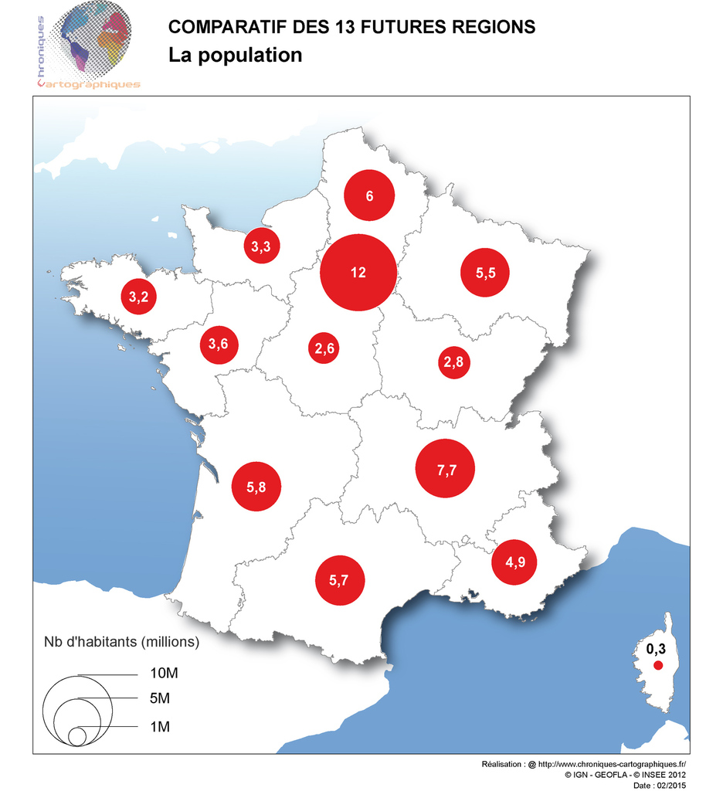

- Une **variable quantitative relative** dont la valeur est ramenée par unité de surface (ex : une densité - nombre d'habitants par km/2). Dans ce cas, les règles de sémiologie graphique préconisent d'utiliser notamment la **valeur** (rapport noir/blanc) comme *variable visuelle* sans nécessairement changer de mode d'implantation. La valeur permet d'exprimer graphiquement des relations de hiérarchie et de différence mais pas de proportionnalité. On construit ainsi des [cartes choroplèthes](https://fr.wikipedia.org/wiki/Carte_choropl%C3%A8the) à l'aide d'un aplat de couleur dont l'intensité varie ou à l'aide d'une trame particulière dont la densité de motifs évolue :

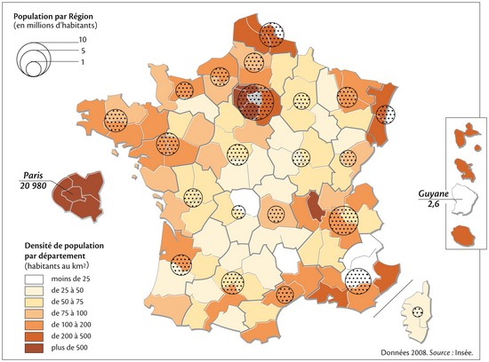

- Une **variable qualitative nominale** en mode d'implantation surfacique. Le message cartographique consiste alors à exprimer des équivalences ou des différences. Pour cela, on utilise généralement la **couleur** comme *variable visuelle* pour ses propriétés d'associativité et de sélectivité.

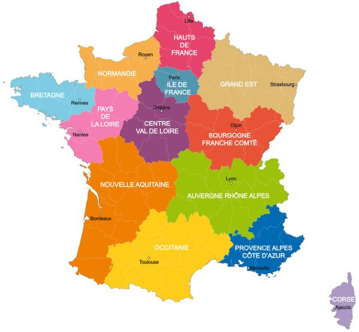

En mode d'implantation ponctuelle, on aura plutôt recours à la *variable visuelle* de **forme** pour exprimer les différences à l'aide de symboles variés.

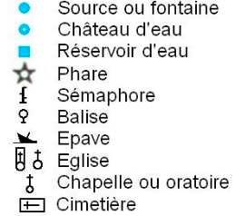{height=100px}


# Créer un nouveau projet QGIS

Quand vous lancez QGIS, commencez par créer un nouveau projet :
`Projet > Nouveau`.

## Choisir une projection adaptée

Par défaut, votre projet utilise le système de référence mondial WGS-84 (celui du GPS), nom de code EPSG:4326. Dans QGIS, le système de référence du projet est toujours affiché en bas à droite de la fenêtre de QGIS. Vous pouvez donc vérifier votre projection :

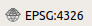

Pour regarder les propriétés de votre projet : `Projet > Propriétés`.

Dans l'onglet `SCR` (Système de Coordonnées de Référence), recherchez  `2154`, soit le code EPSG de la projection Lambert-93 qui est la projection officielle en France depuis 2000 et obligatoire pour les données publiques.

Si vous voulez en savoir plus sur cette projection, reportez-vous à la [page Wikipedia](https://fr.wikipedia.org/wiki/Projection_conique_conforme_de_Lambert) dédiée.

Une fois la projection Lambert-93 (EPSG:2154) validée, vous pouvez à nouveau vérifier en bas à droite de la fenêtre de QGIS :

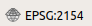

Dans l'onglet `Général`, pensez à donner un nom à votre projet, il apparaîtra à côté du nom de la fenêtre QGIS.

Une fois ces manipulations effectuées, vous pouvez sauvegarder votre projet dans votre dossier de travail (ce dossier contiendra également par la suite vos données vecteur/raster). `Projet > Enregistrer sous...`


## Charger les données

Pour ce TD, il est fourni un fichier vectoriel de type polygone où sont numérisées 10 parcelles de l'exploitation de Borret : `parcelles_borret.gpkg`.

En plus des parcelles, 2 fichiers de type `csv` sont fournis. Ils contiennent des données à intégrer aux parcelles  :

 - `assolement_2018.csv`, la liste par parcelle de ce qui a été récolté en 2018
 - `rendement.csv`, le rendement (qt/ha) par type de culture


# Représenter les parcelles

Dans QGIS 3, il n'y a plus qu'un bouton unique pour ouvrir n'importe quel type de couche.

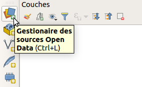{height=150px}

Une fois le fichier `parcelles_borret.gpkg` ouvert, vous pouvez regarder ce qu'il contient en ouvrant sa table d'attributs (`clic droit sur la couche > ouvrir la table d'attributs`).

A ce stade, nous pouvons uniquement représenter les informations contenues dans la table soit les champs `fid` ou `id_parcelle`.

## Couleur et étiquette unique par parcelle

Il s'agit de représenter une information qualitative nominale basée sur la valeur de l'identifiant des parcelles. Chaque parcelle aura ainsi sa propre couleur.

### Étiquette

Clic droit > Propriété de la couche > Étiquettes

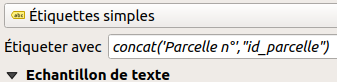

Dans étiquettes simples, choisissez le champs content l'identifiant de la parcelle. N'hésitez pas à changer la police ou à ajouter une ombre pour mieux voir la police par exemple.

Si vous voulez un texte qui indique 'Parcelle n' en plus de la valeur de son identifiant, il faut **concatener** deux textes comme suit :

```
concat('Parcelle n',"id_parcelle")

```

Attention à bien mettre des guillemets simples pour ajouter du texte (sans faire appel à des valeurs d'un champ existant dans la table) et les double guillemets (") pour utiliser les champs (comme ici le champs `id_parcelle`).

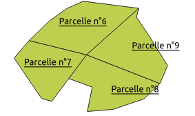{height=150px}


### Couleur (symbologie)

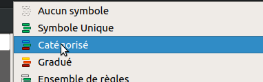{height=100px}

Dans l'onglet symbologie, sélectionnez dans la liste `Catégorisé`.

La colonne servant à colorier les parcelles est la même que celle pour nommer les étiquettes.

Ensuite la ligne `symbole` vous permet de modifier la façon dont votre polygone est représenté (style et largeur du contour de votre polygone par exemple).

Puis, vous pouvez choisir une palette de couleurs. Comme nous sommes sur une information qualitative nominale et que le message cartographique à faire passer est une différence, nous choisirons des couleurs sélectionnées aléatoirement. Vous pouvez désormais cliquer sur le bouton `classer` en bas de la fenêtre.

Le rendu est le suivant :  

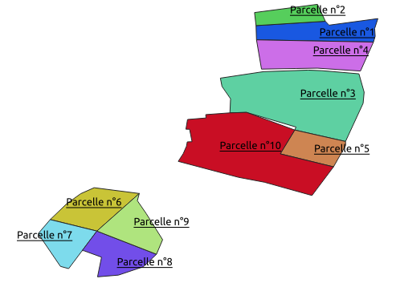

### Amélioration de la carte

Pour améliorer la beauté de votre carte ;-), vous pouvez par exemple :

- ajouter de la transparence à la couleur de chaque parcelle,
- changer le ligne de contour du polygone,
- changer de police.
- choisir l'endroit où sera placé votre texte (`étiquette > position > décalé du centroïd` par exemple)

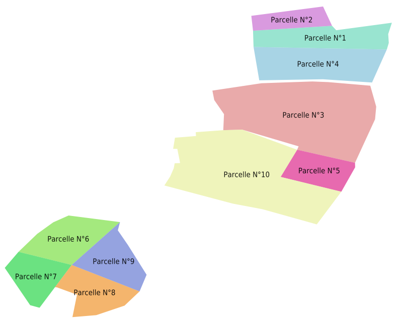


# Créer une carte exportable (jpg/pdf)

Une fois votre symbologie choisie, vous pouvez créer une mise en page afin d'y ajouter des éléments essentiels de compréhension comme :

- un titre
- une légende
- le nord
- la localisation sur un planisphère

Pour ce faire, aller dans le menu `Projet > Nouvelle mise en page`. Pour ajouter la carte que vous venez de réaliser dans QGIS, cliquez sur l'icône `Ajouter une carte` dans le menu à gauche.

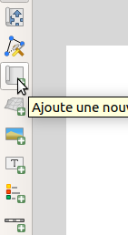

Vous pouvez déplacer le contenu de la carte en utilisant l'icône avec les flêches qui vont dans les 4 sens.


Enfin, si l'emprise de votre carte ne vous satisfait pas, le plus simple est de retourner dans la fenêtre principale de QGIS puis :
clic droit sur les parcelles, et choisissez "Zoomer sur la couche" (autre solution : modifier l'échelle dans les propriétés de l'objet).

À partir QGIS 3.8, sélectionner votre carte puis cliquer sur l'icône `Set Map Extent to Match Main Canvas Extent` pour que votre carte utilise la même emprise que l'emprise de la fenêtre principale de QGIS. Dans les versions antérieures de QGIS, dans `Propriétés de l'objet`, déployez la partie `Emprise` puis, cliquez sur `Fixer sur l'emprise courante du canevas de carte`.

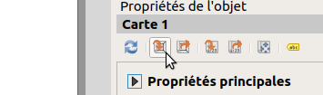.

Vous pouvez ajouter plusieurs textes :
- un titre
- les crédits (qui a fait la carte et avec des données de quelles sources ?).

Et n'oubliez pas d'ajouter une légende (icône légende) et une flèche nord (icône fléche nord). Si vous n'avez pas d'icône flèche du nord (cet icône est présent à partir de la version de QGIS 3.8), il vous faut ajouter une image, puis déployer la partie `Recherche dans les repertoires` et enfin sélectionner votre flèche nord préférée.


Quand la carte vous convient, faites `Mise en page > Exporter au format PDF`, `image` ou `SVG` selon l'utilisation voulue.


N'oubliez pas de sauvegarder votre projet qui contiendra désormais votre première mise en page, félicitations !

# Ajouter l'assolement et la production de l'année 2018

Grâce au fichier `assolement_2018.csv`, nous savons quel type de culture a été récolté pour chaque parcelle.

<<<<<<< HEAD
<<<<<<< HEAD
Grâce au fichier `rendement.csv`, nous connaissons le rendement en quintaux/ha de chaque type de culture.
=======
Grâce au fichier `rendement.csv`, nous connaissons la rendement en quintaux/ha pour chaque type de culture.
>>>>>>> upstream/master
=======
Grâce au fichier `rendement.csv`, nous connaissons le rendement en quintaux/ha de chaque type de culture.
>>>>>>> upstream/master

Il faut donc désormais ajouter ces informations à notre fichier `parcelles.gpkg` pour pouvoir afficher les cultures et leur rendement. Mais pas question de le faire en les saisissant à la main !


Importez vos fichiers CSV directement dans QGIS à partir (`Couche > Ajouter une couche > Ajouter une couche de texte délimité`). Sélectionnez votre fichier csv et cochez la case `Détecter les types de champs` pour que QGIS traite bien les nombres comme une colonne de type numérique et non textuelle. Ces fichiers CSV n'ont pas de géométrie (pas de coordonnées X et Y). Il faudra donc aussi cocher `Pas de géométrie` dans la partie `Définition de la géométrie`.

Pour regarder les informations contenues dans ces fichiers, vous pouvez ouvrir leur table d'attributs comme pour toutes les couches de type texte/vectoriel sur QGIS.

Pour lier des données entre elles, il faut d'abord identifier un champs (colonne) commun dans la table des parcelles et dans les fichiers importés. Ensuite, nous pouvons réaliser ce qu'on appelle une *jointure* (attributaire ici) en se positionnant sur notre fichier de parcelles : `Clic droit > Propriété de la couche > Jointure`.

Une fois que vous avez trouvé la colonne en commun entre le fichier parcelle et le fichier csv, vous pouvez faire la jointure. Ensuite, ouvrez la table attributaire du fichier `parcelles` et vérifiez qu'il contient bien une nouvelle colonne bien remplie (l'assolement ou le rendement).

Bravo ! Vous venez de réaliser votre première jointure :). Il ne vous reste plus qu'à faire la deuxième désormais !

## Sauvegarder la jointure

Les jointures sont en fait un lien entre votre fichier vectoriel et les fichiers csv. Autrement dit, si quelqu'un modifie le fichier CSV, la prochaine fois que vous utiliserez votre projet QGIS, vous aurez alors une cartographie différente.

Pour sauvegarder et donc figer la jointure, vous pouvez faire un clic droit sur votre couche, puis `Exporter > Sauvegarder les entités sous...`.


<<<<<<< HEAD
<<<<<<< HEAD
=======
>>>>>>> upstream/master
## Cartographier le rendement

Réaliser une carte qui montre en étiquette le type de culture (assolement 2018) ainsi que le rendement (en qt/ha) à partir d'un aplat de couleur. Cela correspond à une carte choroplèthe. Du point de vue de la sémiologie graphique, qu'elle est la *variable visuelle* à utiliser ?

<<<<<<< HEAD
=======
## Cartographier le rendement à l'hectare

Réaliser une carte qui montre en étiquette le type de culture, et en couleur (quantitatif) la rendement à l'hectare, c'est ce qu'on appelle une carte choroplèthe.
>>>>>>> upstream/master
=======
>>>>>>> upstream/master

## Cartographier la production totale par parcelle

L'objectif de cette partie est de réaliser une autre carte qui montre la production totale par parcelle. Connaissant le rendement de chaque culture, cette production totale peut être calculée en multipliant la valeur du rendement par la surface des parcelles.

Pour réaliser cette carte correctement, il faut utiliser une représentation par symbole proportionnel. Une carte choroplèthe ne convient pas car elle ne va pas permettre d'exprimer les variations de quantité (production). Seuls un ordre et une différence seront perçus mais pas une proportionnalité.


### Créer un champ et calculer la production totale

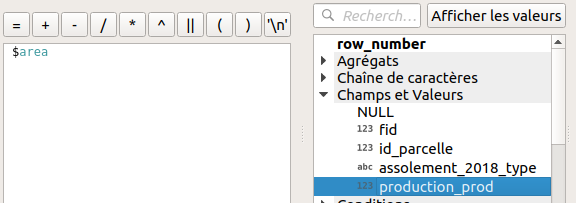

Nous connaissons le rendement par type de culture. Nous allons créer un nouveau champ nommé 'production totale', `Clic droit > ouvrir la table d'attributs` puis :

- Ouvrir la calculatrice de champ (ctrl+i pour les geeks)
- Cocher `Créer un nouveau champ`
- Nom : 'prod_totale'
- Type : réel
- La formule à saisir est :  

```
<<<<<<< HEAD
<<<<<<< HEAD
=======
>>>>>>> upstream/master
$area/10000 *  "rendement"
```

Mais attention, dans le cas présenté, la colonne contenant le rendement (production à l'hectare) par type de culture s'appelle *"rendement"*. Pensez à bien utiliser l'outil d'aide à la création d'expression pour retrouver le nom de votre colonne dans la partie `Champs et valeurs` (cf. image ci-dessus).
<<<<<<< HEAD
=======
$area/10000 *  "rendement_rendement"
```

Mais attention, dans le cas présenté, la colonne contenant la production à l'hectare par type de culture s'appelle *"rendement_rendement"*, pensez à bien utiliser l'outil d'aide à la création d'expression pour retrouver le nom de votre colonne dans la partie `Champs et valeurs` (image ci-dessus)
>>>>>>> upstream/master
=======
>>>>>>> upstream/master

`$area` représente une fonction qui permet de calculer la surface du polygone selon l'unité de mesure de la projection utilisée. Comme nous utilisons du Lambert-93 (EPSG:2154), l'unité est le mètre (ou mètre carré pour des surfaces). Donc, pour calculer en hectare, nous divisons la surface en m2 par 10 000 que nous multiplions aussi par le rendement pour obtenir la production totale.

### Générer le centroïde des polygones

Une fois la production totale calculée, nous pouvons générer les centroïdes des polygones c'est-à-dire, leur centre géographique. Pour cela, dans la `boîte à outils de traitements`, recherchez le mot `centroïdes`, et générez-les (en pensant à bien enregister le fichier dans un endroit choisi avec un nom compréhensible...).


#### Afficher le type et la production en étiquette

Vous pouvez afficher plusieurs informations dans une étiquette comme le type d'assolement, sauter une ligne, et la production totale de la parcelle. Pour cela, on va concatener plusieurs textes (chaînes de caractères), dont un `\n` qui signifie un saut de ligne.

Dans l'étiquette, saisir l'expression suivante :
```
concat("assolement_2018_type",'\n', "prod_totale",'qt')
```

Pour vous familiariser avec l'outil, vous pouvez remplacer la production totale par la production à l'ha et afficher une étiquette sous la forme : `Maïs : 89qt/ha`. Rappelez-vous de la différence entre les simpleset les doubles quotes...

#### Générer les cercles proportionnels

Cette étape permet de déterminer la taille d'un symbole en fonction de la valeur d'un champ. Dans notre cas, nous voulons faire varier la taille d'un cercle en fonction de la production totale de la parcelle.

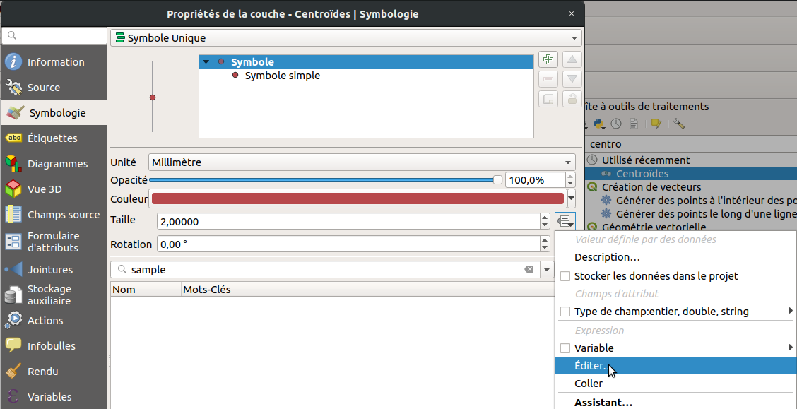

Nous devons d'abord choisir une taille minimale et maximale pour afficher les symboles en faisant en sorte qu'ils ne soient ni trop petit, ni trop grand pour la carte. Ici, les valeurs de production totale varient d'environ 200 à plus de 1000 quintaux ce qui est trop important pour la carte (que ce soit en cm ou en pixels). Nous choisissons de les diviser par 10 pour pouvoir fixer une taille de symbole raisonnable. Inutile de créer un nouveau champ : il suffit simplement, dans le calcul de la taille (clic sur le bouton de droite, `Editer`), de le préciser dans une simple expression.

Ainsi, dans la fenêtre de calcul d'expression, quand vous éditez la taille du cercle (fenêtre symbologie du centroide), vous retrouverez votre nom de champ dans la partie `Champs et valeurs` comme montré ci-dessous.


Une fois l'expression calculée, choisissez comme unité de taille le type `Point` (fenêtre générale `Propriétés de la couche` \ `Symbologie`).

A présent, il faut générer la légende des cercles proportionnels. Pour cela, toujours dans la partie `Symbologie`, en bas à gauche, cliquez sur `Avancé > Légende définie par la taille des symboles`.

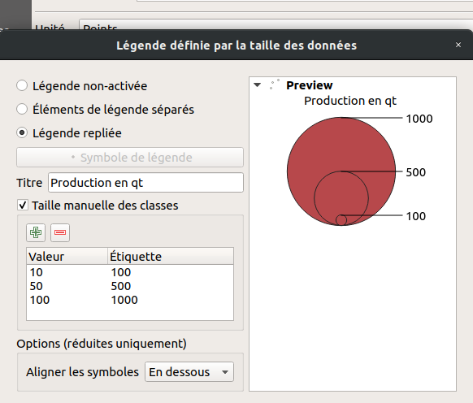

Pour légender les symboles proportionnels, on utilise ce qu'on appelle une légende repliée. Il est nécessaire de définir la taille des classes de manière manuelle car nous avons volontairement divisé par 10 la taille des cercles. Il y a donc une différence d'un facteur 10 entre la valeur de taille et la valeur d'étiquette à préciser (relative à la production totale).

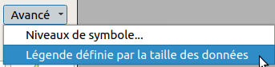{height=50px}

<<<<<<< HEAD
<<<<<<< HEAD
Vous pouvez à nouveau faire une carte en combinant à la fois l'information ponctuelle (ici la production totale de la parcelle) avec le rendement selon le type de culture (exemple ci-dessous - erreur à corriger sur la légende des parcelles).
=======
Enfin, vous pouvez à nouveau faire une carte en combinant à la fois l'information ponctuelle (ici la production totale de la parcelle) avec le rendement à l'hectare selon le type de culture (exemple ci-dessous).
>>>>>>> upstream/master
=======
Vous pouvez à nouveau faire une carte en combinant à la fois l'information ponctuelle (ici la production totale de la parcelle) avec le rendement selon le type de culture (exemple ci-dessous - erreur à corriger sur la légende des parcelles).
>>>>>>> upstream/master

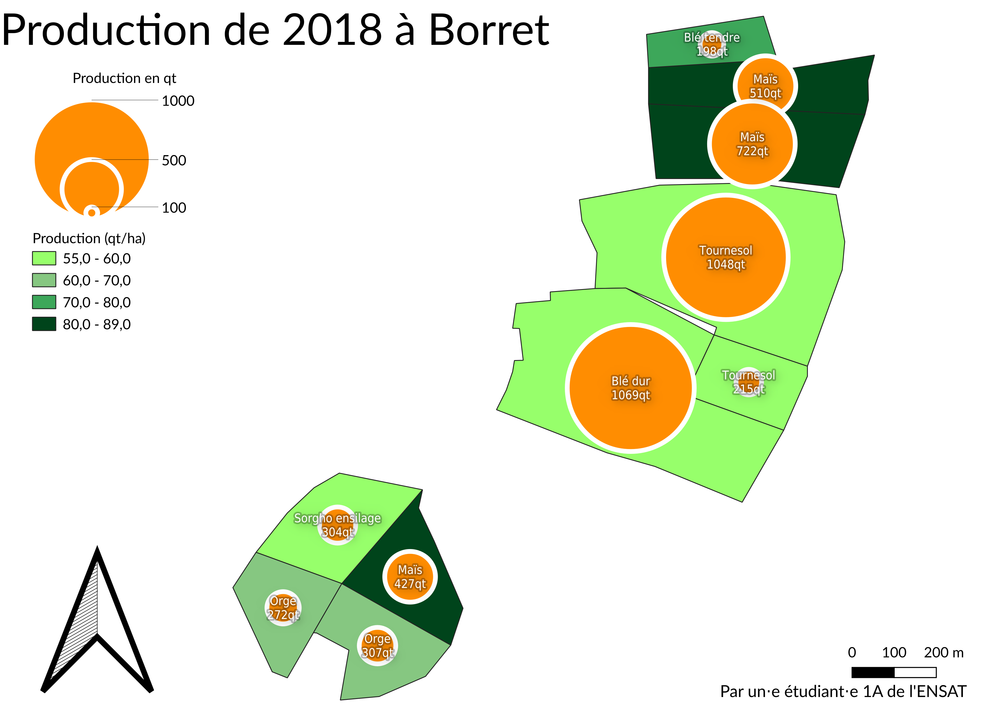


### Ajouter une carte de localisation de la zone d'étude

Dans la fenêtre générale de QGIS (hors composeur de mise en page), ajoutez un fond de carte de type OpenStreetMap (OSM).

Pour ajouter une petite carte (OSM) servant à localiser la zone d'étude sur votre carte principale, il faut tout d'abord cliquer sur le bouton `Ajouter une nouvelle carte à la mise en page`, comme pour votre première carte (dans le composeur de mise en page).

Sélectionnez cette nouvelle carte puis, dans `Propriétés de l'objet`, allez dans la partie `Aperçu` et ajoutez comme cadre votre première carte (celle contenant vos parcelles).

Pour avoir un style différent de votre carte principale (celle des parcelles) il faudra faire des allers-retours entre le composeur de mise en page et QGIS. Par exemple, dans la fenêtre principale de QGIS, mettez juste le fond OSM et désactivez les couches que vous ne voulez pas voir (comme vos parcelles) puis, retournez dans le composeur pour `Verrouiller les couches` de votre carte de localisation (dans l'onglet `Propriétés de l'objet`). Ainsi, quand vous remettrez dans le canevas principal de QGIS votre carte des parcelles, l'aperçu de votre petite carte ne se mettra pas à jour à gardera uniquement l'ancienne configuration.

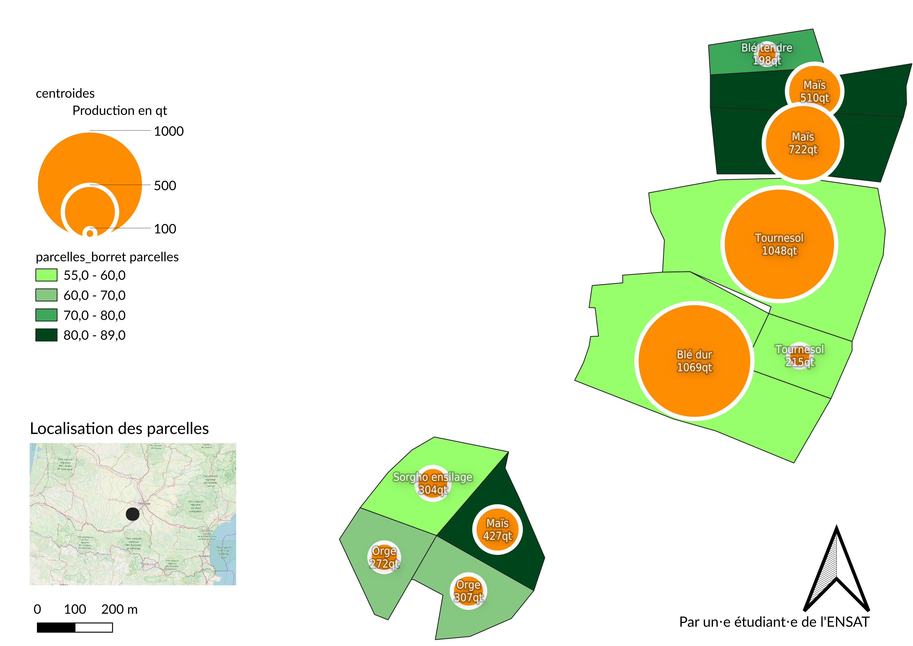


# Génération d'un atlas

Un atlas permet de générer des cartes détaillées en utilisant un modèle identique. C'est par exemple utilisé pour préparer un document pour un relevé sur le terrain en montrant précisément chaque parcelle qui sera étudiée *in situ*.

L'objectif de l'atlas dans notre cas d'étude est de montrer pour chaque parcelle sa production totale et d'indiquer le type de culture.

Cliquez sur l'icône `Paramètres de l'atlas` du menu du composeur d'impression QGIS puis, cochez dans la fenêtre en bas à droite `Générer un atlas`. La couche de couverture est la couche pour laquelle chaque entité sera utilisée par QGIS pour générer chaque page de l'atlas. Nous choisirons ici les polygones des parcelles.

Cliquez ensuite sur votre carte avec l'outil `Sélectionner\Déplacer un objet` et dans `Propriété de l'objet` cochez `Controlée par Atlas`.

Une fois l'atlas créé, sélectionnez votre carte principale (et pas celle de la localisation), allez dans `Propriétés des objets` et cocher la partie `Contrôlé par l'atlas`. Vous pouvez désormais demander à générer votre atlas en cliquant sur le bouton `Aperçu de l'atlas`.

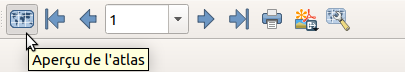{height=60px}

Pour ajouter des valeurs (textuelles ou numériques) en fonction de votre parcelle (comme la production en qt), ajoutez un champ texte (icône texte sur la gauche), cochez la case `Rendu en html` puis cliquer sur `Insérer une expression...`.

Ainsi, il ne sera plus obligatoire d'utiliser la fonction `concat` car chaque variable sera mise entre crochets et entre %, comme par exemple :

```
En 2018, la parcelle n [% "id_parcelle" %] a produit  [% "prod_totale" %] qt de [% "assolement_2018_type" %]

```

Votre atlas sera donc composé de 10 cartes, dont l'une sera du style :

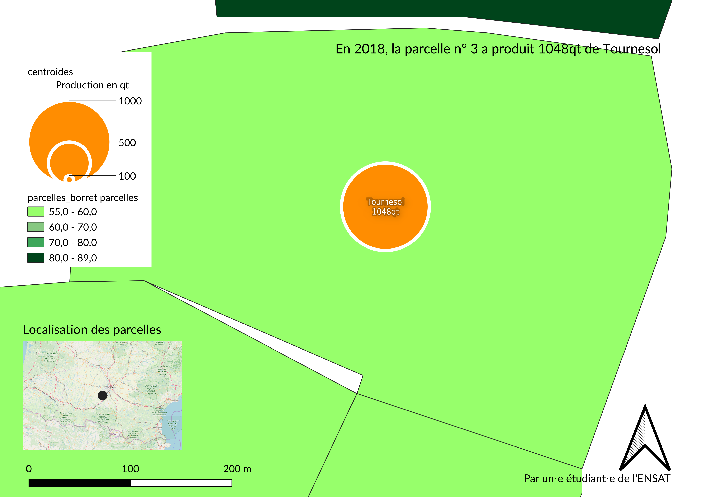
