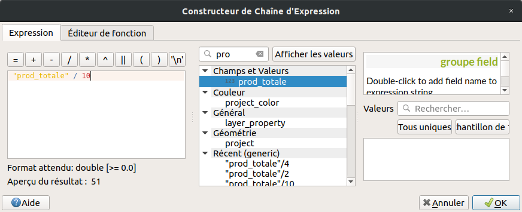

# Comment représenter les données spatiales ?

Pour rappel, le TD d'introduction sur la collecte de données est en ligne à cette adresse : [https://github.com/nkarasiak/1A_DATA-COLLECT](https://github.com/nkarasiak/1A_DATA-COLLECT)

## Objectif du TD

L'objectif de ce TD est de vous faire produire des cartes selon la sémiologie graphique en vigueur, c'est-à-dire les règles graphiques à respecter pour bien représenter vos données.

## Télécharger les données

Les données utilisées pour ce TD sont disponibles à cette adresse : [https://github.com/nkarasiak/1A_DATA-VISU/archive/docs.zip](https://github.com/nkarasiak/1A_DATA-VISU/archive/docs.zip).


## Les grands types de données à représenter

- Une information quantitative mais de surface variable (ex : nombre d'habitants par ville) : [symbole proportionnel](https://www.geoclip.fr/portfolio-item/carte-a-symboles-proportionnels/) : 


- Une information quantitative mais relative à la surface (ex : nombre d'habitants par km/2) : [carte choroplèthe](https://fr.wikipedia.org/wiki/Carte_choropl%C3%A8the) ou une densité de motifs (traits de plus en plus fins par exemple) : 


- Une information qualitative sur une surface : des couleurs ou des motifs différents : 


Une information qualitative sur un point : un symbôle/icône. : 

{height=100px}


# Créer un nouveau projet QGIS

Quand vous lancez QGIS, commencez par créer un nouveau projet : 
`Projet > Nouveau`.

## Choisir une projection adaptée

Par défaut votre projet utilise le système de référence mondial WGS-84 (celui du GPS), nom de code EPSG:4326. Dans QGIS, le système de référence du projet est toujours affiché en bas à droite de la fenêtre de QGIS. Vous pouvez donc vérifier votre projection : 


Pour regarder les propriétés de votre projet : `Projet > Propriétés`.

Dans l'onglet `SCR` (Système de Coordonnées de Référence), recherchez  `2154`, soit le code EPSG de la projection Lambert-93 qui est la projection officielle en France depuis 2000 et obligatoire pour les données publiques. 

Si vous voulez en savoir plus sur cette projection, reportez-vous à la [page Wikipedia](https://fr.wikipedia.org/wiki/Projection_conique_conforme_de_Lambert) dédiée.

Une fois la projection Lambert-93 (EPSG:2154) validée, vous pouvez à nouveau vérifier en bas à droite de la fenêtre de QGIS :


Dans l'onglet `Général`, pensez à donner un nom à votre projet, il apparaîtra à côté du nom de la fenêtre QGIS.

Une fois ces manipulations effectuées, vous pouvez sauvegarder votre projet dans votre dossier de travail (ce dossier contiendra également par la suite vos données vecteur/raster). `Projet > Enregistrer sous...`


## Charger les données

Pour ce TD, il est fourni un fichier vectoriel de type polygone où sont numérisées 10 parcelles de l'exploitation de Borret : `parcelles_borret.gpkg`.

En plus des parcelles, 2 fichiers de type `csv` vous sont fournis, ils contiennent des données à intégrer aux parcelles  : 

 - `assolement_2018.csv`, la liste par parcelle de ce qui a été récolté en 2018
 - `production.csv`, la production (qt/ha) par type de culture


# Représenter les parcelles

Dans QGIS 3, il n'y a plus qu'un bouton unique pour ouvrir n'importe quel type de couche.

{height=150px}

Une fois le fichier `parcelles_borret.gpkg` ouvert, vous pouvez regarder ce qu'il contient en ouvrant sa table d'attributs (`clic droit sur la couche > ouvrir la table d'attributs`).

Nous pouvons donc représenter pour l'instant uniquement les informations contenues dans la table, donc soit le champs `fid`, soit le champs `id_parcelle`.

## Couleur et étiquette unique par parcelle

Il s'agit de représenter une information qualitative, donc chaque parcelle aura sa propre couleur.

### Étiquette

Clic droit > Propriété de la couche > Étiquettes


Dans étiquettes simples, choisissez le champs content l'identifiant de la parcelle. N'hésitez pas à changer la police, à ajouter un ombre pour mieux voir la police par exemple.

Si vous voulez ajouter en plus du numéro de la parcelle, un texte qui indique 'Parcelle n', il vous faut alors **concatener** deux textes comme suit : 

```

`concat('Parcelle n',"id_parcelle")`

```

Attention à bien mettre des guillemets simples pour ajouter du texte, les double guillemets (") sont utilisés pour nommer les champs (comme ici le champs `id_parcelle`).

{height=150px}


### Couleur (symbologie)

{height=100px}

Dans l'onglet symbologie, sélectionner dans la liste Catégorisé.

La colonne servant coloriser les parcelles à est la même que pour les étiquettes.

Ensuite la ligne `symbole` vous permet de modifier comment votre polygone est représenté (style et largeur du contour de votre polygone par exemple).

Puis vous pouvez choisir une palette de couleurs. Comme nous sommes sur une information qualitative, nous prendrons que des couleurs sélectionnées aléatoirement.

Le rendu est le suivant :  


### Amélioration de la carte

Pour améliorer la beauté de votre carte, vous pouvez par exemple : 

- ajouter de la transparence à la couleur de chaque parcelle,
- changer le ligne de contour du polygone,
- changer de police.
- choisir l'endoirt où sera placé votre texte (`étiquette > position > décalé du centroïd` par exemple)


# Créer une carte exportable (jpg/pdf)

Une fois votre symbologie choisie, vous pouvez créer une mise en page afin d'y ajouter des éléments essentiels de compréhension comme :

- un titre
- une légende
- le nord
- la localisation sur un planisphère

Pour ce faire, aller dans le menu `Projet > Nouvelle mise en page`.


Pour ajouter la carte que vous venez de réaliser dans Qgis, cliquez sur l'icône `Ajouter une carte` dans le menu à gauche.


Vous pouvez déplacer le contenu de la carte en utilisant l'icône avec les flêches qui vont dans les 4 sens.

Enfin, si l'emprise de votre carte ne vous satisfait pas, le plus simple est de retourner dans la fenêtre principal de Qgis puis : 
clic droit sur les parcelles, et choisissez "Zommer sur la couche".

Puis dans le composeur, cliquer sur l'icône `Set Map Extent to Match Main Canvas Extent` pour que votre carte utilise la même emprise que l'emprise de la fenêtre principale de QGIS.

.

Vous pouvez ajouter plusieurs textes : 
- un titre
- les crédits (qui a fait la carte et avec des données de quelles sources ?).

Et n'oubliez pas d'ajouter une légende (icône légende) et une flêche nord (icône fléche nord).


Quand la carte vous convient, faites `Mise en page > Exporter au format PDF`, `image` ou `SVG` selon l'utilisation voulue.


N'oubliez pas de sauvegarder votre projet qui contiendra désormais votre première mise en page, félicitations !

# Ajouter l'assolement et la production de l'année 2018

Gràce au fichier `assolement_2018.csv`, nous savons quel type de culture à été récolté pour chaque parcelle.

Grâce au fichier `production.csv`, nous connaissons la production en quintaux/ha pour chaque type de culture.

Il faut donc désormais ajouter des colonnes à notre fichier `parcelles.gpkg` pour pouvoir afficher les cultures, et la production totale de la parcelle. Mais pas question de le faire en les saisissant à la main !


Importer vos fichiers CSV directement dans QGIS à partir (`Couche > Ajouter une couche > Ajouter une couche de texte délimité`). Sélectionner votre fichier csv et cocher la case `Détecter les types de champs` pour que QGIS traite bien les nombres comme une colonne de type numérique et non textuelle. Ces fichiers CSV n'ont pas de géométrie (pas de coordonnées X et Y, il faudra donc aussi cocher `Pas de géométrie` dans la partie `Définition de la géométrie`).

Pour regarder les informations contenues dans ces fichiers, vous pouvez ouvrir leur table d'attributs comme pour toutes les couches de type texte/vectoriel sur QGIS.

Pour lier des données entre elles, il nous faut un champs (colonne) en commun, puis nous pouvons faire ce qu'on appelle une jointure à partir de notre fichier parcelles : `Clic droit > Propriété de la couche > Jointure`.

Une fois que vous avez trouver la colonne en commun entre le fichier parcelle et le fichier csv, vous pouvez faire la jointure. Une fois cette dernière faite, ouvrez la table attributaire du fichier `parcelles` et vérifier qu'il contient bien une nouvelle colonne bien remplie. Bravo, vous venez de faire votre première jointure :). Il ne vous reste plus qu'à faire la deuxième désormais !

## Sauvegarder la jointure

Les jointures sont en fait un lien entre votre fichier vectoriel et les fichiers csv, c'est-à-dire que si quelqu'un modifie le fichier CSV, la prochaine fois que vous utiliserez votre projet QGIS, vous aurez alors une cartographie différente.

Pour sauvegarder et donc figer la jointure, vous pouvez faire un clic droit sur votre couche, puis `Exporter > Sauvegarder les entités sous...`.


## Cartographier la production à l'hectare

Réaliser une carte qui montre en étiquette le type de culture, et en couleur (quantitatif) la production à l'hectare, c'est ce qu'on appelle une carte choroplèthe.

## Cartographier la production totale par parcelle

L'objectif de cette partie est de réaliser qui montre la production totale par parcelle.

Pour réaliser cette carte, il faut représenter la donnée d'une façon moins conventionnelle, à partir de symbole proportionnel. Comme la taille de la parcelle va impacter la production totale de la parcelle, nous ne pouvons pas utiliser une carte choroplèthe comme à l'étape précédente.

### Calculer la production à l'hectare


Tout d'abord, nous connaissons la production à l'hectare selon le type de culture. Il faut donc créer un nouveau champ nommé 'production', `Clic droit > ouvrir la table d'attributs` puis : 

- Ouvrir la calculatrice de champ (ctrl+i pour les geeks)
- Cocher `Créer un nouveau champ`
- Nom : 'prod_totale'
- La formule à saisir est :  
```
$area/10000 *  "production_prod"$
```

Mais attention, dans le cas présenté, la colonne contenant la production à l'hectare par type de culture s'appelle *"production_prod"*, pensez à bien utiliser l'outil d'aide à la création d'expression pour retrouver le nom de votre colonne dans la partie `Champs et valeurs` (image ci-dessus)

`$area` représente la surface du polygone selon l'unité de mesure de la projection utilisée, comme nous utilisons du Lambert-93 (EPSG:2154), l'unité est le mètre. Donc pour calculer en hectare, nous divisons par 10 000 la surface que nous multiplions aussi par la production à l'hectare.

### Générer le centroïd des polygones

Une fois la colonne contenant la totalité de la production de la parcelle a été calculée, nous pouvons générer les centroïds des polygones, c'est-à-dire leur centre géographique.

Pour cela, dans la `boîte à outils de traitements`, rechercher le mot `centroïdes`, et générez-les (pensez à bien enregister le fichier dans un endroit choisi avec un nom compréhensible).

Vous pouvez afficher plusieurs informations dans une étiquette comme le type d'assolement, sauter une ligne, et la production totale de la parcelle, pour cela on va concatener plusieurs textes, dont un `\n` qui signifie un saut de ligne.

#### Afficher le type et la production en étiquette

Dans l'étiquette, saisir l'expression suivante : 
```
`concat("assolement_2018_type",'\n', "prod_totale",'qt')`
```

Pour vous familiariser avec l'outil, vous pouvez remplacer la production totale par la production à l'ha et afficher une étiquette sous la forme : `Maïs : 89qt/ha`

#### Générer les cercles proportionnels

Cette étape permet de déterminer la taille d'un symbole en fonction de la valeur d'un champ. Dans notre cas, nous voulons faire varier la taille du cercle en fonction de la production totale de la parcelle.


Cependant, les valeurs allant d'environ 200 à plus de 1000 sont trop importantes pour afficher dans une carte (que ce soit en cm ou en pixels). Nous avons donc décidé de les diviser par 10 pour avoir des nouvelles valeurs qui s'échelonnent entre 20 et 100. Pour cela, pas besoin de créer un nouveau champ, il suffira de créer une simple expression dans le calcul de la taille.

Dans la fenêtre du calcul d'expression quand vous éditer la taille du cercle (fenêtre symbologie du centroide), vous retrouverez votre nom de champ dans la partie `Champs et valeurs` comme montré ci-dessous.



Choisissez le type `Point` comme unité de taille.


Maintenant, il faut générer la légende des cercles proportionnels. Pour cela, toujours dans la partie symbologie, en bas à gauche cliquez sur `Avancé > Légende définie par la taille des symboles`.


Pour légender les symboles proportionnels, on utilise ce qu'on appelle une légende repliée. Il est nécessaire de définir la taille des classes de manière manuelle car comme on a volontairement divisé par 10 la taille des cercles. Il faura donc bien veiller à ce que la valeur du cercle soit 10 fois inférieure à son étiquette.

{height=50px}

Enfin, vous pouvez à nouveau faire une carte en combinant à la fois l'information ponctuelle (ici la production totale de la parcelle) avec la production à l'hectare selon le type de culture (exemple ci-dessous).


N'hésitez pas à ajouter un fond de type OpenStreetMap.

### Ajouter une carte de localisation de la zone d'étude

Pour ajouter une petite carte servant à localiser la zone d'étude, il faut tout d'abord cliquer comme pour votre première carte sur le bouton `Ajouter une nouvelle carte à la mise en page`.

Sélectionner cette nouvelle carte, puis dans `Propriétés de l'objet` , aller dans la partie `Aperçu` et ajouter  comme cadre votre première carte (celle contenant vos parcelles).

Pour avoir un style différent de votre carte principale (celle des parcelles) il faudra faire des allers-retours entre le composeur d'impression et QGIS. Par exemple dans la fenêtre principale de QGIS, mettez juste un fond de type OpenStreetMap par dessus l'ensemble des couches (et désactivez les couches que vous ne voulez pas voir comme vos parcelles), puis retourner dans le composeur pour `Verrouiller les couches` de votre carte de localisation (dans l'onglet `Propriétés de l'objet`). Ainsi que vous remettrez dans le canvas principal de QGIS votre carte des parcelles, l'aperçu de votre petite carte ne se mettra pas à jour à gardera uniquement l'ancienne configuration.


# Génération d'un atlas

Un atlas permet de générer des cartes détaillées en utilisant un modèle identique. Cela est par exemple utilisé pour faciliter le travail de terrain en montrant précisément chaque parcelle qui sera étudiée in situ.

L'objectif de l'atlas dans notre cas d'étude est de montrer pour chaque parcelle sa production totale en qt et d'indiquer le type de culture.

Cliquer sur l'icône `Paramètres de l'atlas` du menu du composeur d'impression Qgis, puis cocher dans la fenêtre en bas à droite `Générer un atlas`.

Cliquer sur votre carte avec l'outil `Sélectionner\Déplacer un objet` et dans `Propriété de l'objet` cocher `Controlée par Atlas`.

La couche de couverture est la couche pour laquelle chaque entité sera utilisée par QGIS pour générer chaque page de l'atlas. Nous choisirons ici le polygone des parcelles.

Une fois l'atlas créé, sélectionner votre carte principale (et pas celle de la localisation des parcelles), aller dans `Propriétés des objets` et cocher la partie `Contrôlé par l'atlas`. Vous pouvez désormais demander à générer votre atlas en cliquant sur le bouton `Aperçu de l'atlas`.

{height=60px}

Pour ajouter des valeurs (textuelles ou numériques) en fonction de votre parcelle (comme la production en qt), ajouter un champ texte (icône texte sur la gauche), cocher la case `Rendu en html` puis cliquer sur `Insérer une expression...`.

Ainsi, il ne sera plus obligatoire d'utiliser la fonction `concat` car chaque variable sera mise entre crochets et entre %, comme par exemple :

```
En 2018, la parcelle n [% "id_parcelle" %] a produit  [% "prod_totale" %] qt de [% "assolement_2018_type" %]

```

Votre atlas sera donc composé de 10 cartes, dont l'une sera du style : 


